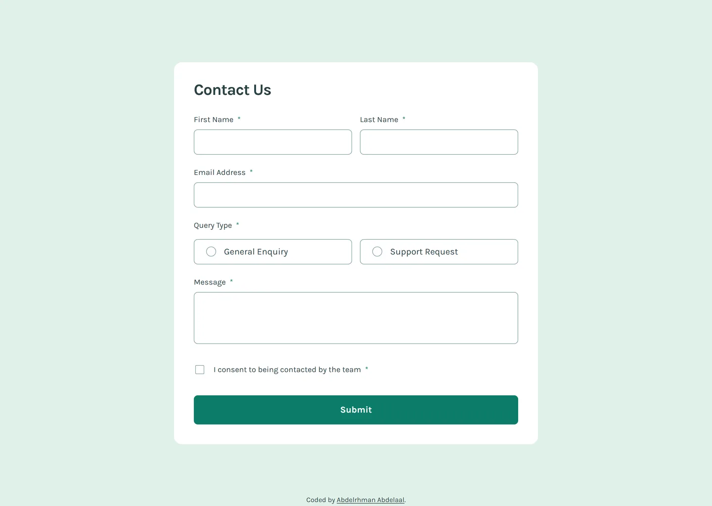

# Frontend Mentor - Contact form solution

This is a solution to the [Contact form challenge on Frontend Mentor](https://www.frontendmentor.io/challenges/contact-form--G-hYlqKJj). Frontend Mentor challenges help you improve your coding skills by building realistic projects.

## Table of contents

- [Overview](#overview)
  - [Screenshot](#screenshot)
  - [Links](#links)
- [My process](#my-process)
  - [Built with](#built-with)
  - [Design deviations](#design-deviations)
- [Author](#author)

## Overview

### Screenshot

### Links

- Solution URL: [GitHub](https://github.com/MrBlackvanta/contact-form)
- Live Site URL: [Cloudflare](https://contact-form.abdelrhman-ahmed8881.workers.dev)

## My process

### Built with

- [Next.js 16](https://nextjs.org/) (App Router, React Compiler, Turbopack)
- [React 19](https://react.dev/)
- [TypeScript](https://www.typescriptlang.org/) (strict)
- [Tailwind CSS v4](https://tailwindcss.com/)

### Design deviations

**Every text pairing in the design passes WCAG AA. Three non-text pairings fail 1.4.11**, and all
three are the same ink. Ratios are measured on rounded 8-bit channels against the backdrop the
element actually sits on.

|                            | design                       | contrast | shipped                | contrast |
| -------------------------- | ---------------------------- | -------- | ---------------------- | -------- |
| Field / radio card border  | `#86A2A5` on `#FFFFFF`       | 2.72     | `#7B9A9D` on `#FFFFFF` | 3.02     |
| Checkbox box, unchecked    | `#86A2A5` on `#FFFFFF`       | 2.72     | `#7B9A9D` on `#FFFFFF` | 3.02     |
| Radio circle, unchecked    | `#86A2A5` @50% on `#FFFFFF`  | 1.59     | `#7B9A9D` on `#FFFFFF` | 3.02     |

**Grey 500 moved four HSL lightness points, from `hsl(186 15% 59%)` to `hsl(186 15% 55%)`** — the
smallest step that clears 3:1, hue and saturation untouched. It is the only grey in the design, so
one token fixes all three. The radio's unchecked circle also loses the design's 50% paint opacity:
composited over white that ink is `#C2D0D2` at 1.59, and no opacity below 100% can reach 3:1 from
`#7B9A9D`, so the circle ships at full strength. That is the one visible change — the empty radios
read a shade firmer than the mockup.

**Every colour comes from the `.fig`, not the style guide.** The style guide's HSL values round to
different hex than the file paints: Grey 900 is `#2A4144` in the file against `#2B4246` from
`hsl(187 24% 22%)`, Green 200 `#E0F1E8` against `#E0F1E7`, Grey 500 `#86A2A5` against `#87A3A6`.
Green 600 and the red are the only two that agree exactly.

**The heading's tracking is `-0.03125em` (-1px at 32px), not the -2px the file's metadata claims.**
The Desktop and Mobile frames record -2 while the Tablet, Error and Success frames record -1, so
the metadata contradicts itself. Rendering "Contact Us" in Karla Bold 32 gives 163px of ink; the
exported JPGs measure 154 on the desktop, mobile and error frames alike, which is -1 across the
board. -2 would have measured 145.

**The button's hover green is not in the file.** The Button component's hover variant carries the
same `#0C7D69` as its default state — only the exported `hover-state.jpg` shows the change. Sampled
off that render it is `#063F36`, which is Green 600 at half lightness, `hsl(170 83% 14%)`.

**Padding is 11px vertically, not 12.** Figma draws the field's 1px stroke *inside* the 51px box, so
the 12px it measures from the frame edge to the text already contains the stroke. CSS borders sit
outside the padding box, so `py-3` plus a 1px border makes the field 53 tall. `py-2.75` lands it on
51 exactly, and the text one pixel right of the drawn position.

**The two-column layout starts at 640px, not the tablet frame's 768.** Held at 768 the mobile
layout stretches to a 735px-wide card holding a single column of full-width fields and a 240px
textarea, which is the worst the page ever looks. At 640 the switch happens while the card is still
narrow enough for the stacked layout to make sense, and 768 itself renders the tablet design.

**The card is 688px wide at 768, against the drawn 690.** The design's 39px side gutter has no round
equivalent; `px-10` costs one pixel a side and keeps the gutter on the spacing scale. Every other
breakpoint is exact.

**The textarea shrinks as the viewport grows** — 240px on mobile, 132 on tablet, 105 on desktop. That
is what the three frames draw, and it holds roughly constant character capacity as the card widens.

**The consent checkbox's asterisk ships green.** The file puts it inside the label's own text node,
which is `#2A4144`, but the exported renders show it the same green as every other required mark.
The render wins.

**Nothing in the design has a hover state except the text fields and the button**, and the brief
asks for hover feedback on every interactive element. The radio cards and the checkbox borrow the
text field's treatment: the border goes Green 600. The footer's links darken to Green 800 rather
than Green 600, which reads 4.31 against the page and would fail as body text.

**Focus is a 2px Green 600 outline at 2px offset, not the design's green border.** The design draws
focus and hover identically, which leaves a keyboard user unable to tell the two apart. The outline
sits outside the control so it never disturbs layout, and it applies only on `:focus-visible`.

**The success toast has no close button and does not auto-dismiss.** The file carries a second toast
variant that has one, but the Desktop, Tablet and Mobile success frames all use the variant without
it. It clears on the next submission instead. It lives inside a permanently mounted `role="status"`
region and is keyed by a submission counter, so a second successful submission remounts it and is
announced again rather than passing silently.

**Validation runs on submit, then live.** Nothing is flagged before the first submit; after it, the
errors recompute during render from the current values, so a field clears the moment it is fixed.
Focus moves to the first invalid control, which makes a screen reader announce its label, its
invalid state, and the error text through `aria-describedby`.

**No scroll reveals.** The page is one card centred in the viewport — at 1440x1029 the document is
1030px against a 1030px viewport, so there is nothing to reveal.

**Karla ships as a single 24 KB woff2.** Requesting weights 400 and 700 returns Google's variable
font split by unicode range, and both weights resolve to the same latin file; the latin-ext face is
never fetched. It is the only preload on the page, and the page makes no image requests at all —
the checkbox, radio and check marks are CSS and inline SVG.

## Author

- UpWork - [Abdelrhman Abdelaal](https://upwork.com/freelancers/~01f0a9479696b61f49)
- Frontend Mentor - [@MrBlackvanta](https://www.frontendmentor.io/profile/MrBlackvanta)
- LinkedIn - [Abdelrhman Abdelaal](https://www.linkedin.com/in/abdelrhman-vanta/)
